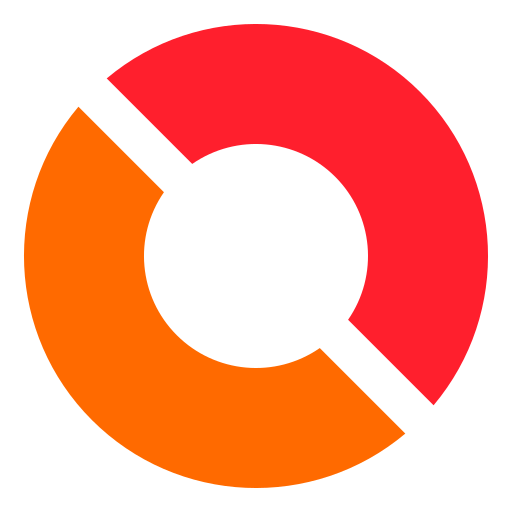

  

<h1 align="center">Oredlab</h1>

Developer • AI • Art community

<h1 align="center">Ored - the art community</h1>

oredlab is a curated platform for digital artists to showcase exceptional artwork, build a professional portfolio, connect with a global creative community, and gain the recognition their talent deserves

<h1 align="center">Live site</h1>

https://oredlab.com

<h1 align="center">Features</h1>

 
  - Dynamic gallery and profile view.
  - Artist follow, like , messages ,etc
  
  - Communities, friends, merit system and many more.
  - No AI art , only human art

<h1 align="center">Licence</h1>

Copyright © 2026 OREDLAB

Licensed under the Apache License, Version 2.0.

You may use, modify, and distribute this project in accordance with the terms of the Apache License 2.0.

See the ""LICENSE"" (LICENSE) file for the complete license terms.

<h1 align="center">Team</h1>

The oredlab Team — oredlab.com
  
  - Albaze (Harsh)
  - Koe (Anish)
  

